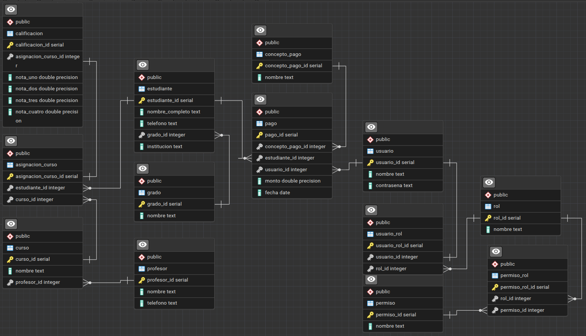
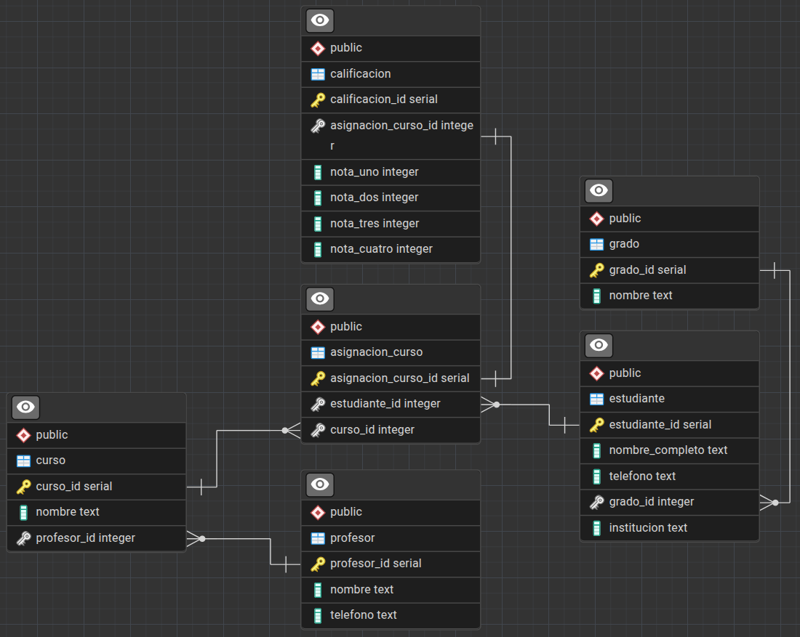
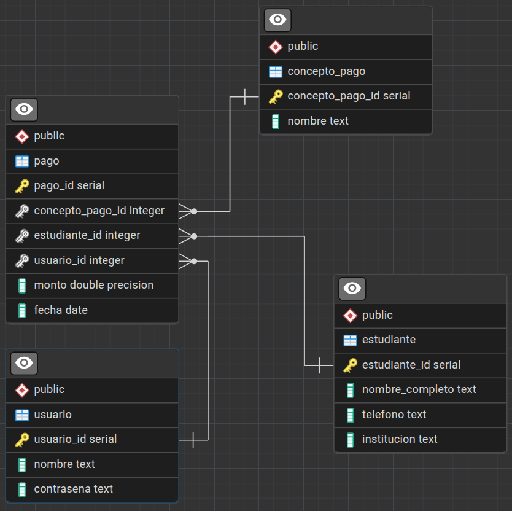
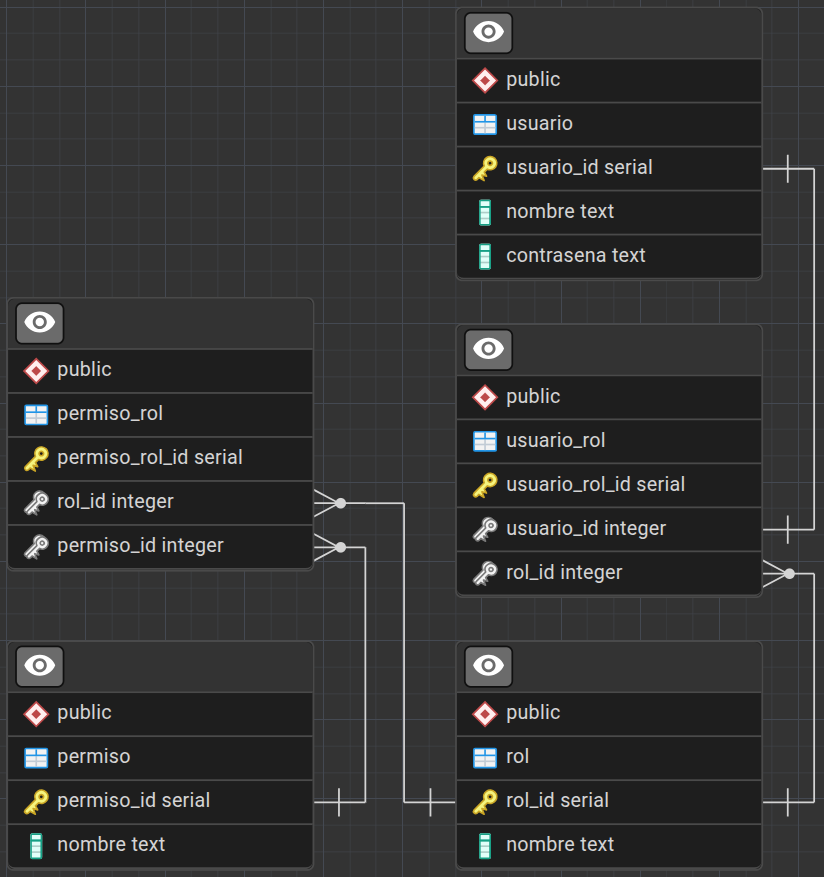

# Entidades de la base de datos para **_FinGestor_**

En el  siguiente diagrama podemos encontrar **13 entidades** "normalizadas" y relacionadas, esta base fue escrita en Postgresql. 

## Entidades y Relaciones para la Gestion de Asignaciones, Estudiantes y Cursos

### Detalles

### Tabla 'grado'

| Campo    | Tipo   | Restricciones | Descripción                                |
| -------- | ------ | ------------- | ------------------------------------------ |
| grado_id | SERIAL | PRIMARY KEY   | Identificador único del grado.             |
| nombre   | TEXT   | NOT NULL      | Nombre del grado (Primero, Segundo, etc.). |

### Tabla 'estudiante'

| Campo           | Tipo    | Restricciones        | Descripción                                  |
| --------------- | ------- | -------------------- | -------------------------------------------- |
| estudiante_id   | SERIAL  | PRIMARY KEY          | Identificador único del estudiante.          |
| nombre_completo | TEXT    | NOT NULL             | Nombre completo del estudiante.              |
| telefono        | TEXT    |                      | Número de contacto.                          |
| grado_id        | INTEGER | FK → grado(grado_id) | Relaciona el estudiante con su grado.        |
| institucion     | TEXT    |                      | Nombre de la institución a la que pertenece. |

> Relaciones:

> grado_id → grado.grado_id (N:1)

> asignacion_curso.estudiante_id → estudiante.estudiante_id (N:1)

### Tabla 'profesor'

| Campo       | Tipo   | Restricciones | Descripción                       |
| ----------- | ------ | ------------- | --------------------------------- |
| profesor_id | SERIAL | PRIMARY KEY   | Identificador único del profesor. |
| nombre      | TEXT   | NOT NULL      | Nombre completo del profesor.     |
| telefono    | TEXT   |               | Número de contacto del profesor.  |

> Relaciones:

> curso.profesor_id → profesor.profesor_id (N:1)

### Tabla 'curso'

| Campo       | Tipo    | Restricciones              | Descripción                                    |
| ----------- | ------- | -------------------------- | ---------------------------------------------- |
| curso_id    | SERIAL  | PRIMARY KEY                | Identificador único del curso.                 |
| nombre      | TEXT    | NOT NULL                   | Nombre del curso (Matemática, Ciencias, etc.). |
| profesor_id | INTEGER | FK → profesor(profesor_id) | Profesor responsable del curso.                |

> Relaciones:

> profesor_id → profesor.profesor_id (N:1)

> asignacion_curso.curso_id → curso.curso_id (N:1)

### Tabla 'asignacion_curso'

| Campo               | Tipo    | Restricciones                  | Descripción                           |
| ------------------- | ------- | ------------------------------ | ------------------------------------- |
| asignacion_curso_id | SERIAL  | PRIMARY KEY                    | Identificador único de la asignación. |
| estudiante_id       | INTEGER | FK → estudiante(estudiante_id) | Estudiante asignado al curso.         |
| curso_id            | INTEGER | FK → curso(curso_id)           | Curso asignado al estudiante.         |

> Relaciones:

> estudiante_id → estudiante.estudiante_id (N:1)

> curso_id → curso.curso_id (N:1)

> calificacion.asignacion_curso_id → asignacion_curso.asignacion_curso_id (1:1)

### Tabla 'calificacion'

| Campo               | Tipo    | Restricciones                                      | Descripción                                                 |
| ------------------- | ------- | -------------------------------------------------- | ----------------------------------------------------------- |
| calificacion_id     | SERIAL  | PRIMARY KEY                                        | Identificador único de la calificación.                     |
| asignacion_curso_id | INTEGER | FK → asignacion_curso(asignacion_curso_id), UNIQUE | Cada asignación tiene una sola calificación (relación 1:1). |
| nota                | INTEGER | CHECK (nota >=0 AND nota <= 100)                   | Nota del estudiante en ese curso.                           |

> Relaciones:

> asignacion_curso_id → asignacion_curso.asignacion_curso_id (1:1)

## Entidades y Relaciones para la Gestion de Pagos

### Tabla de 'estudiantes'

| Campo           | Tipo   | Restricciones | Descripción                              |
| --------------- | ------ | ------------- | ---------------------------------------- |
| estudiante_id   | SERIAL | PRIMARY KEY   | Identificador único del estudiante.      |
| nombre_completo | TEXT   | NOT NULL      | Nombre completo del estudiante.          |
| telefono        | TEXT   |               | Número de contacto del estudiante.       |
| institucion     | TEXT   |               | Nombre de la institución del estudiante. |

> Relaciones:

> pago.estudiante_id → estudiante.estudiante_id (N:1)

### Tabla de 'concepto_pago'

| Campo            | Tipo   | Restricciones | Descripción                                               |
| ---------------- | ------ | ------------- | --------------------------------------------------------- |
| concepto_pago_id | SERIAL | PRIMARY KEY   | Identificador único del concepto de pago.                 |
| nombre           | TEXT   | NOT NULL      | Nombre del concepto (ej. Inscripción, Papelería, Examen). |

> Relaciones:

> pago.concepto_pago_id → concepto_pago.concepto_pago_id (N:1)

### Tabla 'usuario'

| Campo      | Tipo   | Restricciones | Descripción                                |
| ---------- | ------ | ------------- | ------------------------------------------ |
| usuario_id | SERIAL | PRIMARY KEY   | Identificador único del usuario.           |
| nombre     | TEXT   | NOT NULL      | Nombre del usuario que registra los pagos. |
| contrasena | TEXT   | NOT NULL      | Contraseña para autenticación.             |

> Relaciones:

> pago.usuario_id → usuario.usuario_id (N:1)

### Tabla 'pago'

| Campo            | Tipo    | Restricciones                        | Descripción                     |
| ---------------- | ------- | ------------------------------------ | ------------------------------- |
| pago_id          | SERIAL  | PRIMARY KEY                          | Identificador único del pago.   |
| concepto_pago_id | INTEGER | FK → concepto_pago(concepto_pago_id) | Concepto asociado al pago.      |
| estudiante_id    | INTEGER | FK → estudiante(estudiante_id)       | Estudiante que realiza el pago. |
| usuario_id       | INTEGER | FK → usuario(usuario_id)             | Usuario que registra el pago.   |
| monto            | FLOAT   | NOT NULL                             | Monto pagado.                   |
| fecha            | DATE    | DEFAULT CURRENT_DATE                 | Fecha del pago.                 |

## Entidades Relacion para la Gestion de usuarios, Roles y Autenticacion.

### Detalles

### Tabla de 'rol'

| Campo  | Tipo   | Restricciones | Descripción                                            |
| ------ | ------ | ------------- | ------------------------------------------------------ |
| rol_id | SERIAL | PRIMARY KEY   | Identificador único del rol.                           |
| nombre | TEXT   | NOT NULL      | Nombre del rol (ej. Administrador, Usuario, Invitado). |

> Relaciones:

> usuario_rol.rol_id → rol.rol_id (N:1)

> permiso_rol.rol_id → rol.rol_id (N:1)

### Tabla de 'permiso'

| Campo      | Tipo   | Restricciones | Descripción                                     |
| ---------- | ------ | ------------- | ----------------------------------------------- |
| permiso_id | SERIAL | PRIMARY KEY   | Identificador único del permiso.                |
| nombre     | TEXT   | NOT NULL      | Nombre del permiso (ej. Ver, Editar, Eliminar). |

> Relaciones:

> permiso_rol.permiso_id → permiso.permiso_id (N:1)

### Tabla de 'usuario'

| Campo      | Tipo   | Restricciones | Descripción                      |
| ---------- | ------ | ------------- | -------------------------------- |
| usuario_id | SERIAL | PRIMARY KEY   | Identificador único del usuario. |
| nombre     | TEXT   | NOT NULL      | Nombre del usuario.              |
| contrasena | TEXT   | NOT NULL      | Contraseña para autenticación.   |

> Relaciones:

> usuario_rol.usuario_id → usuario.usuario_id (1:1)

### Tabla de 'usuario_rol'

| Campo          | Tipo    | Restricciones                    | Descripción                                  |
| -------------- | ------- | -------------------------------- | -------------------------------------------- |
| usuario_rol_id | SERIAL  | PRIMARY KEY                      | Identificador único de la asignación de rol. |
| usuario_id     | INTEGER | UNIQUE, FK → usuario(usuario_id) | Cada usuario puede tener un solo rol (1:1).  |
| rol_id         | INTEGER | FK → rol(rol_id)                 | Rol asignado al usuario.                     |

### Tabla de 'permiso_rol'

| Campo          | Tipo    | Restricciones            | Descripción                                            |
| -------------- | ------- | ------------------------ | ------------------------------------------------------ |
| permiso_rol_id | SERIAL  | PRIMARY KEY              | Identificador único de la asignación de permiso a rol. |
| rol_id         | INTEGER | FK → rol(rol_id)         | Rol asociado al permiso.                               |
| permiso_id     | INTEGER | FK → permiso(permiso_id) | Permiso asignado al rol.                               |

> Relaciones:

> Un rol puede tener múltiples permisos.

> Un permiso puede ser asignado a varios roles.

**Desarrollo por 'Brandoon Gonzalez'**